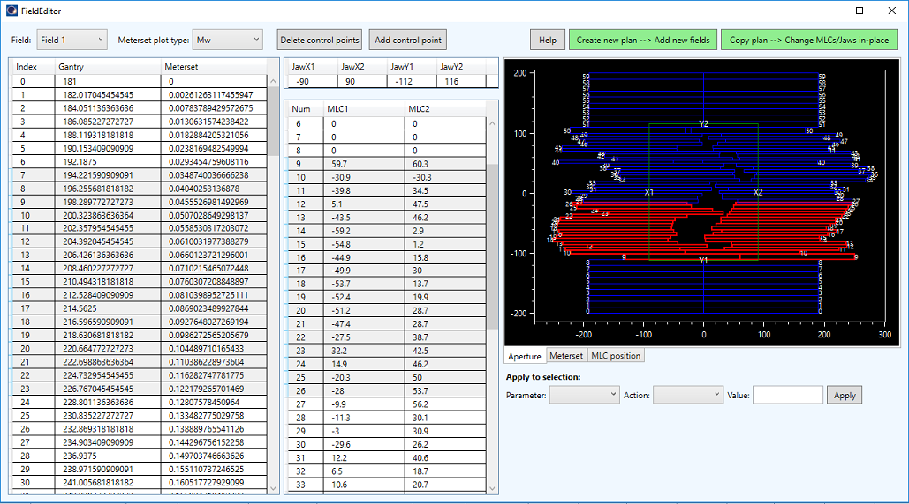

# FieldEditor
A Varian ESAPI script for viewing and editing field parameters, mostly MLC and Jaw positions and meterset weights. It works for dynamic fields (IMRT and VMAT) with standard collimators.



## Setup

To use the script, you must compile it on your system. You should be able to open the project with Visual Studio 2019 Community Edition. Open the .sln file. 
The script was developed for Eclipse version 15.6. It may not work with other versions of Eclipse or Varian ESAPI.

1. You will need to restore NuGet package for compilation: OxyPlot. Right click the solution -> Restore NuGet packages.
2. Don't forget the references to Varian dlls.
3. Compile as Release for x64.

## How to use the script

The script must be used on a plan that contains dynamic fields. 
The script reads the data from the fields and displays them in tables that can be edited. Modified data can then be saved back to the plan. 
You have two options:

**Create new plan -> Add new fields**

The script will create a new plan and use ESAPI methods to add appropriate fields, taking into account the values in the data tables. Only four types of  fields can be added. The script will try to recognize the types of beams from the data in the first data table. See below.

**Copy plan -> Change MLCs/Jaws in-place**

The opened plan will be copied. Fields in the plan will remain, but the script will try to  change the parameters. Only MLC and Jaw positions can be changed that way. Careful: this method will also leave a "modified" status on the original plan!

## Recognized types of fields


**Step and shoot IMRT:**

All control points have the same gantry angle. Meterset weight follows this pattern:
~~~
0, A, A, B, B, C, C, ..., Z, Z, 1.
~~~

MLC leaves can move only between control points with equal meterset weight.

**Sliding window IMRT:**

All control points have the same gantry angle. Meterset weight follows this pattern:
~~~
0, A, B, C, ..., Z, 1
~~~
where no two values are the same.

**VMAT:**

Gantry angle is not constant. Meterset weight follows an almost arbitrary pattern.

**Conformal arc (constant dose rate VMAT):**

Gantry angle is not constant. Meterset weight follows a specific pattern in such way that the quotient d(Mw) / d(gantry) is constant. Here d(Mw) is the difference in meterset weight between two neighbouring control points, and d(gantry) is the difference in gantry angles between the same two points.


## Recognized collimators

The script will read the MLC model from the first dynamic field in the plan. Four types of MLCs are recognized:

- Varian High Definition 120
- Millennium 120
- Millennium 80
- SX2 (Halcyon)
- Agility (Elekta)
 
 
## Details
1. Modifying gantry angles mostly does not have the effect one would like. When creating new fields, ESAPI will define gantry angles on its own.
2. Creating Halcyon fields, for the moment, does not work. You can only modify existing fields.
3. Even if the script can create/modify a plan, the result may be invalid. Say, for example, creating a VMAT field with only a couple of control points. Or trying to create a mixed Step and shoot/Sliding window  IMRT field etc.
4. If for arc fields d(Mw) / d(gantry) changes by more than 4 % between control points (tested only on one such segment), the field will be considered as VMAT. The script will try to use the corresponding method for creating the field. Otherwise the script will try to create a Conformal arc beam.
5. When creating beams, the script reads certain data from existing field in the plan, that is energy, treatment unit, dose rate, technique, couch angle, isocentre, MLC type, gantry rotation direction. All these parameters cannot be changed, so always start with the appropriate field.
  

## Log


## Important note

**Before using this program see the [licence](https://github.com/brjdenis/VarianESAPI-FieldEditor/blob/master/LICENSE) and make sure you understand it. The program comes with absolutely no guarantees of any kind.**

```
THE SOFTWARE IS PROVIDED "AS IS", WITHOUT WARRANTY OF ANY KIND, EXPRESS OR
IMPLIED, INCLUDING BUT NOT LIMITED TO THE WARRANTIES OF MERCHANTABILITY,
FITNESS FOR A PARTICULAR PURPOSE AND NONINFRINGEMENT. IN NO EVENT SHALL THE
AUTHORS OR COPYRIGHT HOLDERS BE LIABLE FOR ANY CLAIM, DAMAGES OR OTHER
LIABILITY, WHETHER IN AN ACTION OF CONTRACT, TORT OR OTHERWISE, ARISING FROM,
OUT OF OR IN CONNECTION WITH THE SOFTWARE OR THE USE OR OTHER DEALINGS IN THE
SOFTWARE.
```


## LICENSE

Published under the MIT license. 