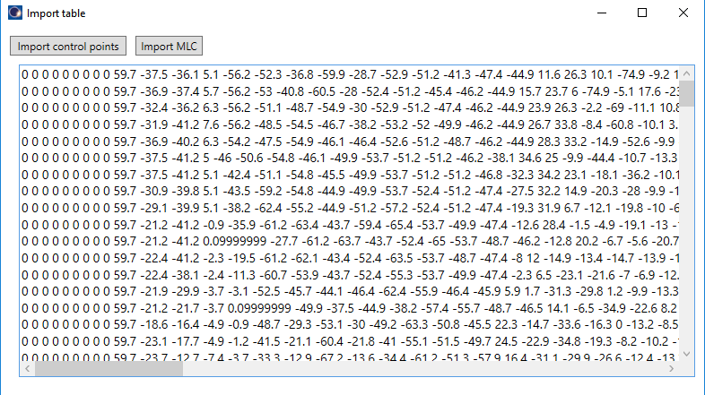

# FieldEditor
A Varian ESAPI script for viewing and editing field parameters, mostly MLC and Jaw positions and meterset weights. It works for dynamic fields (IMRT and VMAT) with standard collimators.


## Setup

To use the script, you must compile it on your system. You should be able to open the project with Visual Studio 2019 Community Edition. Open the .sln file. 
The script was developed for Eclipse version 15.6. It may not work with other versions of Eclipse or Varian ESAPI.

1. You will need to restore NuGet package for compilation: OxyPlot. Right click the solution -> Restore NuGet packages.
2. Don't forget the references to Varian dlls.
3. Compile as Release for x64.

## How to use the script

The script must be used on a plan that contains dynamic fields. 
The script reads the data from the fields and displays them in tables that can be edited. Modified data can then be saved back to the plan. 
You have two options:

**Create new plan -> Add new fields**

The script will create a new plan and use ESAPI methods to add appropriate fields, taking into account the values in the data tables. Only four types of  fields can be added. The script will try to recognize the types of beams from the data in the first data table. See below.

**Copy plan -> Change MLCs/Jaws in-place**

The opened plan will be copied. Fields in the plan will remain, but the script will try to  change the parameters. Only MLC and Jaw positions can be changed that way. Careful: this method will also leave a "modified" status on the original plan!

## Recognized types of fields


**Step and shoot IMRT:**

All control points have the same gantry angle. Meterset weight follows this pattern:
~~~
0, A, A, B, B, C, C, ..., Z, Z, 1.
~~~

MLC leaves can move only between control points with equal meterset weight.

**Sliding window IMRT:**

All control points have the same gantry angle. Meterset weight follows this pattern:
~~~
0, A, B, C, ..., Z, 1
~~~
where no two values are the same.

**VMAT:**

Gantry angle is not constant. Meterset weight follows an almost arbitrary pattern.

**Conformal arc (constant dose rate VMAT):**

Gantry angle is not constant. Meterset weight follows a specific pattern in such way that the quotient d(Mw) / d(gantry) is constant. Here d(Mw) is the difference in meterset weight between two neighbouring control points, and d(gantry) is the difference in gantry angles between the same two points.


## Recognized collimators

The script will read the MLC model from the first dynamic field in the plan. Four types of MLCs are recognized:

- Varian High Definition 120
- Millennium 120
- Millennium 80
- SX2 (Halcyon)
- Agility (Elekta)
 
## Tricks

- To move MLC in bulk/batch, select multiple control points and MLCs. You can do that by holding down CTRL or SHIFT and clicking on the rows. After you select control points and try to select MLCs, control points will remain selected.
- You can zoom in and pan the plot with the mouse. Use right and middle buttons.
- Adding control points is something not particularly useful with VMAT plans, because that may render them invalid. But it is useful for IMRT plans. The rule is: when adding a control points, its meterset weight and MLC positions will be interpolated between its neighbors.
- Say you wish to convert a VMAT plan into a "conformal arc", that is a plan with equally dynamic leaves, but with a constant dose rate (see above). Simply import a new set of meterset weights, such that the quotient dMw/dgantry is constant. This can be achieved with this formula: Mw_i = Mw_i-1 + DELTA * gantry-angle_difference where DELTA = 1/ARCLENGTH and the first Mw_0 = 0. And then click "Create plan".

## Importing data from Excel

Meterset weight and gantry angle can be imported with the "Import control points" button. MLC positions can be imported with the "Import MLC" button. And Jaw positions
 can be imported with the "Import Jaws" button.
 
To import meterset weight/gantry angles do this:

1. Select the beam you would like to import/re-write. 
2. Copy the data (CTRL + C) to Excel and edit the data.
3. Copy the data from Excel to the Import window. Make sure the structure is correct: the last line empty, each row must have exactly three columns, separated with whitespace. Click import. You do not need to close the import window.
 

 
To import MLC positions do this:

1. Select the beam you would like to modify.
2. Click the "Copy mlc" button. The data will be copied to the clipboard.
3. Paste the data into Excel using the "Import text wizard". Use whitespace as the delimiter.
4. Edit the data, and copy-paste it into the import window of FieldEditor. Click the "Import MLC" button.  The data has to be in exactly the right format, that is:
	- MLC1_0 MLC1_1 MLC1_2 .... MLC2_0 MLC2_1 ...
	- MLC1_0 MLC1_1 MLC1_2 .... MLC2_0 MLC2_1 ...
	- MLC1_0 MLC1_1 MLC1_2 .... MLC2_0 MLC2_1 ...
	- etc for each control point in the right order...



To import Jaw positions do this:

1. Select the beam you would like to modify.
2. Click the "Copy Jaws" button. The data will be copied to the clipboard.
3. Paste the data into Excel using the "Import text wizard". Use whitespace as the delimiter.
4. Edit the data, and copy-paste it into the import window of FieldEditor. Click the "Import Jaws" button.  The data has to be in exactly the right format, that is:
	- X1 X2 Y1 Y2
	- X1 X2 Y1 Y2
	- X1 X2 Y1 Y2
	- etc for each control points


## Details
0. Values for parameters are the same as in ESAPI (or Eclipse). Numbering of MLC leaves is also the same as in Eclipse, up to the fact that indexing starts with 0, not with 1.
1. Modifying gantry angles mostly does not have the effect one would like. When creating new fields, ESAPI will define gantry angles on its own.
2. Creating Halcyon fields, for the moment, does not work. You can only modify existing fields.
3. Even if the script can create/modify a plan, the result may be invalid. Say, for example, creating a VMAT field with only a couple of control points. Or trying to create a mixed Step and shoot/Sliding window  IMRT field etc.
4. If for arc fields d(Mw) / d(gantry) changes by more than 4 % between control points (tested only on one such segment), the field will be considered as VMAT. The script will try to use the corresponding method for creating the field. Otherwise the script will try to create a Conformal arc beam. It is possible that this 4 % threshold is not generally valid, and may depend on machine characterization. In this case, you will have to modify the script.
5. When creating beams, the script reads certain data from existing field in the plan, that is energy, treatment unit, dose rate, technique, couch angle, isocentre, MLC type, gantry rotation direction. All these parameters cannot be changed, so always start with the appropriate field.
6. When applying an action to selected MLC leaves, the script will check whether any two opposing leaves will collide and prevent that from happening. However, Eclipse may still raise an error, so always run the "Verify mlc parameters".
7. Meterset plot comes in three forms: Mw, dMw and dMw/dgantry. The second one is just the difference between neighbouring points.
  

## Log

- (27.1.2022) Added the option of importing meterset weights and MLC positions from text files.
- (28.1.2022) Added the option of importing jaw positions from text files.


## Important note

**Before using this program see the [licence](https://github.com/brjdenis/VarianESAPI-FieldEditor/blob/master/LICENSE) and make sure you understand it. The program comes with absolutely no guarantees of any kind.**

```
THE SOFTWARE IS PROVIDED "AS IS", WITHOUT WARRANTY OF ANY KIND, EXPRESS OR
IMPLIED, INCLUDING BUT NOT LIMITED TO THE WARRANTIES OF MERCHANTABILITY,
FITNESS FOR A PARTICULAR PURPOSE AND NONINFRINGEMENT. IN NO EVENT SHALL THE
AUTHORS OR COPYRIGHT HOLDERS BE LIABLE FOR ANY CLAIM, DAMAGES OR OTHER
LIABILITY, WHETHER IN AN ACTION OF CONTRACT, TORT OR OTHERWISE, ARISING FROM,
OUT OF OR IN CONNECTION WITH THE SOFTWARE OR THE USE OR OTHER DEALINGS IN THE
SOFTWARE.
```


## LICENSE

Published under the MIT license. 